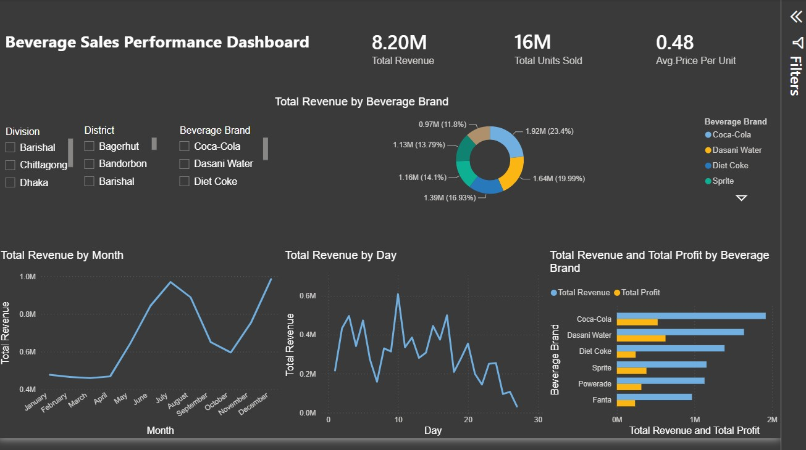

# 🥤 Beverage Sales Performance Analysis

## 📊 Power BI Dashboard

An interactive **Beverage Sales Performance Dashboard** developed in Power BI to analyze sales revenue, units sold, pricing, profitability, and brand performance.

The dashboard provides a comprehensive view of beverage sales performance across different brands, months, days, divisions, and districts.

---

## 🖼️ Dashboard Preview



---

## 🎯 Project Objective

The main objective of this project is to analyze beverage sales data and transform raw sales information into meaningful business insights through an interactive Power BI dashboard.

The analysis focuses on:

- Revenue performance
- Units sold
- Average price per unit
- Brand-wise sales performance
- Monthly revenue trends
- Daily revenue trends
- Revenue vs. profit analysis
- Geographic filtering by Division and District

---

## 📌 Key Performance Indicators

| KPI | Value |
|---|---:|
| **Total Revenue** | 8.20M |
| **Total Units Sold** | 16M |
| **Average Price per Unit** | 0.48 |

---

## 📈 Dashboard Features

### 1. Total Revenue by Beverage Brand

The donut chart shows the contribution of each beverage brand to total revenue.

Brands analyzed include:

- Coca-Cola
- Dasani Water
- Diet Coke
- Sprite
- Powerade
- Fanta

---

### 2. Monthly Revenue Analysis

The monthly trend visual helps identify changes in revenue throughout the year.

Key observations include:

- Revenue remained relatively stable during the early months.
- Revenue increased significantly from May to July.
- July recorded one of the highest revenue levels.
- Revenue declined during August–October.
- Revenue increased again toward the end of the year, with December showing strong performance.

---

### 3. Daily Revenue Analysis

The daily revenue trend provides a closer look at sales fluctuations throughout the month.

It helps identify:

- High-performing sales days
- Low-performing sales days
- Revenue fluctuations
- Daily sales patterns

---

### 4. Revenue & Profit by Beverage Brand

The horizontal bar chart compares **Total Revenue** and **Total Profit** across beverage brands.

This helps understand:

- Which brands generate higher revenue
- Which brands contribute more profit
- Differences between sales volume and profitability
- Brand-level financial performance

---

## 🔎 Interactive Filters

The dashboard includes interactive filters that allow users to analyze performance by:

### Division
- Barishal
- Chittagong
- Dhaka

### District
- Bagerhut
- Bandorbon
- Barishal
- And other available districts

### Beverage Brand
- Coca-Cola
- Dasani Water
- Diet Coke
- Sprite
- Powerade
- Fanta

These filters make it possible to perform more detailed regional and brand-level analysis.

---

## 💡 Business Insights

The dashboard can help business stakeholders:

- Identify high-performing beverage brands
- Monitor revenue trends over time
- Compare revenue and profit across brands
- Identify sales fluctuations by day
- Analyze regional sales performance
- Understand product pricing and unit sales
- Support data-driven sales and marketing decisions

---

## 🛠️ Tools & Technologies

- **Microsoft Power BI**
- **Power Query**
- **DAX**
- **Microsoft Excel**
- **Data Visualization**
- **Business Intelligence**
- **Data Analysis**

---

## 📊 Skills Demonstrated

This project demonstrates practical skills in:

- Data Cleaning
- Data Transformation
- Data Modeling
- DAX Measures
- KPI Development
- Interactive Dashboard Design
- Data Visualization
- Sales Analysis
- Profitability Analysis
- Trend Analysis
- Business Intelligence

---

## 📂 Project Structure

```text
Beverage-Sales-Performance-Analysis/
│
├── image/
│   └── Beverage.jpg
│
├── Beverage Sales Performance.pbix
│
└── README.md
